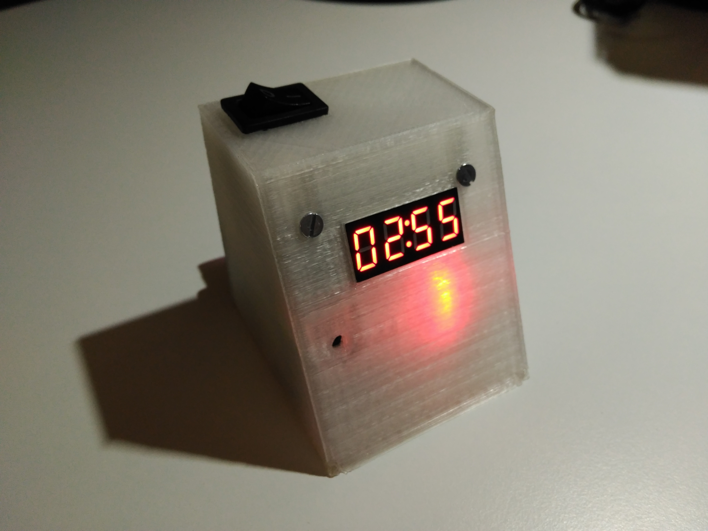

# Temporizador

Cronómetro para tomar tiempos en las pruebas de robots seguidores de línea.
Este proyecto está basado en los temporizadores de Xavier Puigmal y Andreu Marsal.

Está compuesto por una Arduino mini pro, un display de segmentos, un buzzer, un sensor de distancia, una batería lipo 2S con divisor resistivo para monitorizarla y un interruptor.

El [display de segmentos](http://www.prometec.net/display-con-interface/) se alimenta a 5V y tiene un integrado que actúa de interfaz I2C entre el display y la Arduino. A veces esa comunicación da problemas y hace que el primer dígito que muestra el display sea erróneo, por lo que aconsejo que en vez de utilizar este display se haga uso de otro directamente conectado a la Arduino sin interfaz I2C. El problema actual puede deberse a que la interfaz esté físicamente defectuosa, que haya ruido en el circuito o que las librerías no estén adaptadas correctamente para el display. En cualquier caso no compensa invertir tiempo en modificarlo porque las vueltas suelen ser de menos de 10 segundos en las pruebas de carreras en las que estoy acostumbrado a participar.

El buzzer va conectado a la Arduino según el siguiente esquema, donde SPK1 es el pin analógico de la Arduino y la tensión es +5V, en vez de +3V3:

El sensor de distancia es un E18-D80NK. Proporciona una salida digital para la detección de objetos y tiene un potenciómetro para variar el rango de detección. Una de sus principales ventajas es que es bastante direccional en uno de sus dos ejes, lo cual permite que se pueda colocar cerca del suelo y en paralelo con este sin llegar a detectarlo. La mejor posición se consigue colocando el plano determinado por los haces de emisión y recepción paralelo al suelo. Si se gira 90 grados es muy probable que detecte el suelo. Este sensor tiene colector abierto, es decir, hay que conectar una resistencia de 1K entre Vcc y el colector del sensor. En esta [imagen](https://www.robotics.org.za/image/catalog/11000_Sensors/IR_Sensor/E18-D80NK_04.jpg) se muestra el diagrama de conexión, aunque cambian la resistencia de 1K por una de 10K.

La batería Lipo de 2S llega a 8V4, por lo que la he conectado al pin RAW de la Arduino mini Pro para alimentar toda la electrónica a través de su regulador de 5V. He incluido un interruptor y he colocado un [divisor resistivo](https://upload.wikimedia.org/wikipedia/commons/d/db/Resistive_divider.png) con R1=33KOhm y R2=47KOhm para leer la tensión de batería a través de un pin analógico de la Arduino. Es muy importante bajar de Vin=8V4 (máximo) de la batería a Vout=5V (máximo) admitidos en el puerto analógico para no estropearlo. De ahí que haya elegido esos valores de resistencias. Cuando la batería baja de una determinada tensión, enciendo el led para saber que la tensión está baja y que tengo que recargar la batería.

[Vídeo de las pruebas de la electrónica.](https://youtu.be/k0APr93qXZY)
[Vídeo del temporizador terminado.](https://youtu.be/zVGfbdwtDH8)

## Authors

[Rubén Espino San José](https://github.com/Resaj)

## License

Todos estos productos están liberados mediante [Creative Commons Attribution-ShareAlike 4.0 International License](http://creativecommons.org/licenses/by-sa/4.0/).  

_All these products are released under [Creative Commons Attribution-ShareAlike 4.0 International License](http://creativecommons.org/licenses/by-sa/4.0/)._
